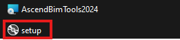
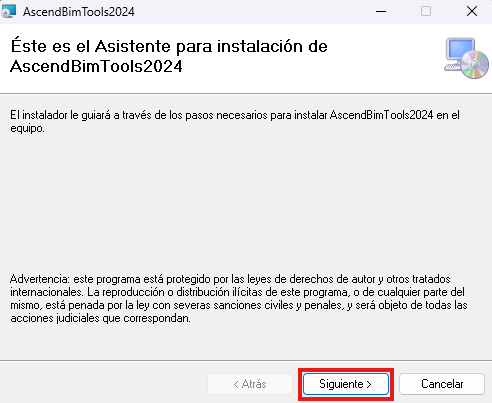
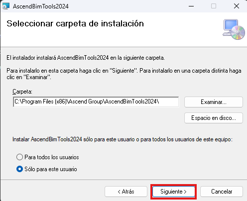
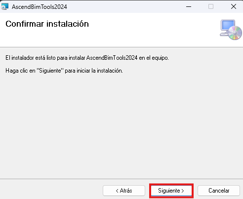
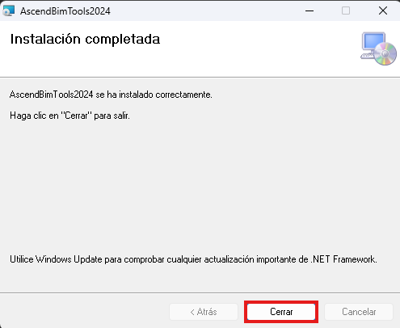

Ascend BIM Tools es un plugin para Revit que añade una cinta de herramientas con funciones adicionales, facilitando tareas específicas que no están disponibles en el software original. Aquí puedes descargar los instaladores para cada versión de Revit y obtener las herramientas necesarias para optimizar tus proyectos BIM. Para gestionar tu licencia, contacta a Hugo Gómez en hugo.gomez@ascend.net.co.

## Instalación
1. Descomprimir el archivo .rar en una carpeta.
2. Abrir el archivo con el nombre "setup".
- 
3. Se va abrir el asistente del instalador, vamos a clickear "siguiente".
- 
4. Elegimos en que carpeta deseamos instalarlo ya seleccionado le clickeamos "siguiente".
- 
5. Procedemos con la instalación del programa le clickeamos "siguiente".
- 
6. Ya con el programa instalado finalizamos el proceso clickeando "cerrar".
- 

## Licencia
Para solicitar tu licencia contacta a Hugo Gomez en hugo.gomez@ascend.net.co.

## Tenemos un programa para cada versión de revit.

| AscendBIMTools | Link de cada versión |
| - | -- |
| v.2021 | [AscendBIMTools2021](https://github.com/Forsa-Ascend/AscendBIMToolsVersions/releases/tag/v.2021) |
| v.2022 | [AscendBIMTools2022](https://github.com/Forsa-Ascend/AscendBIMToolsVersions/releases/tag/v.2022) |
| v.2023 | [AscendBIMTools2023](https://github.com/Forsa-Ascend/AscendBIMToolsVersions/releases/tag/v.2023) |
| v.2024 | [AscendBIMTools2024](https://github.com/Forsa-Ascend/AscendBIMToolsVersions/releases/tag/v.2024) |
